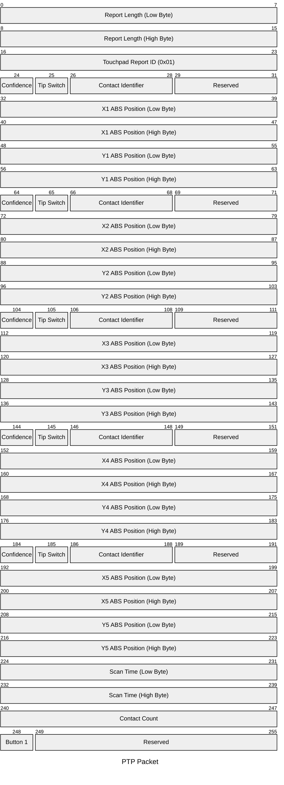
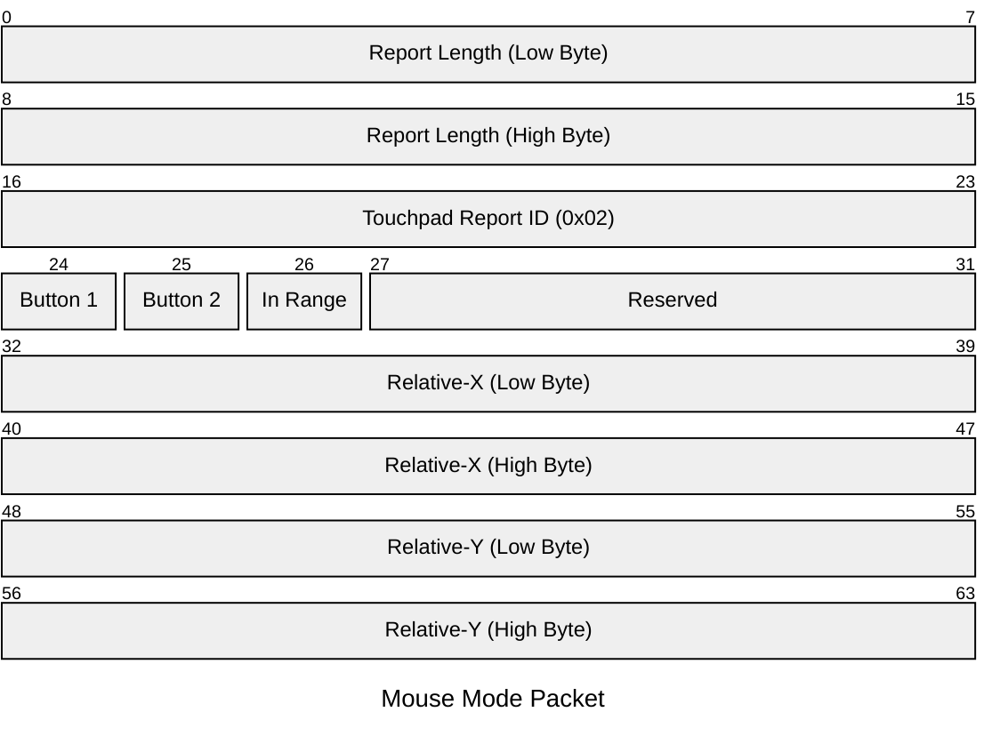

# Framework 12 Touchpad

For the connector's pinout, check the the [README](README.md).

## Silkscreen

| Label | Type      | Description    |
|-------|-----------|----------------|
| J1    | Connector | FPC Connector  |
| TP1   | Testpoint | 5V             |
| TP2   | Testpoint | 3.3V           |
| TP3   | Testpoint | TP I2C SCL     |
| TP4   | Testpoint | TP I2C SDA     |
| TP5   | Testpoint | TP I2C INT     |
| TP6   | Testpoint | KB I2C SCL     |
| TP7   | Testpoint | KB I2C SDA     |
| TP8   | Testpoint | KB I2C INT     |
| TP10  | Testpoint | GND            |
| TP11  | Testpoint | Lid            |
| U1    | KB IC     | ITE IT8801     |
| U4    | Touch IC  | Pixart PCT2342 |
| R13   | Resistor  | Board ID       |
| R13   | Resistor  | I2C SDA Pullup |
| R16   | Resistor  | I2C SCL Pullup |

## Firmware

The touchpad presents as an I2C HID device at address 0x2C.
Below the HID Report descriptor and details about some reports are documented.

### HID Reports

Report ID 1 - PTP (Precision Touchpad)



Report ID 2 - Mouse Mode



### HID Report Descriptor

```
# 0x05, 0x0d,                    // Usage Page (Digitizers)             0
# 0x09, 0x05,                    // Usage (Touch Pad)                   2
# 0xa1, 0x01,                    // Collection (Application)            4
# 0x85, 0x01,                    //  Report ID (1)                      6
# 0x05, 0x0d,                    //  Usage Page (Digitizers)            8
# 0x09, 0x22,                    //  Usage (Finger)                     10
# 0xa1, 0x02,                    //  Collection (Logical)               12
# 0x15, 0x00,                    //   Logical Minimum (0)               14
# 0x25, 0x01,                    //   Logical Maximum (1)               16
# 0x09, 0x47,                    //   Usage (Confidence)                18
# 0x09, 0x42,                    //   Usage (Tip Switch)                20
# 0x95, 0x02,                    //   Report Count (2)                  22
# 0x75, 0x01,                    //   Report Size (1)                   24
# 0x81, 0x02,                    //   Input (Data,Var,Abs)              26
# 0x95, 0x01,                    //   Report Count (1)                  28
# 0x75, 0x03,                    //   Report Size (3)                   30
# 0x25, 0x07,                    //   Logical Maximum (7)               32
# 0x09, 0x51,                    //   Usage (Contact Id)                34
# 0x81, 0x02,                    //   Input (Data,Var,Abs)              36
# 0x75, 0x01,                    //   Report Size (1)                   38
# 0x95, 0x03,                    //   Report Count (3)                  40
# 0x81, 0x03,                    //   Input (Cnst,Var,Abs)              42
# 0x05, 0x01,                    //   Usage Page (Generic Desktop)      44
# 0x15, 0x00,                    //   Logical Minimum (0)               46
# 0x26, 0x4a, 0x05,              //   Logical Maximum (1354)            48
# 0x75, 0x10,                    //   Report Size (16)                  51
# 0x55, 0x0e,                    //   Unit Exponent (-2)                53
# 0x65, 0x11,                    //   Unit (SILinear: cm)               55
# 0x09, 0x30,                    //   Usage (X)                         57
# 0x35, 0x00,                    //   Physical Minimum (0)              59
# 0x46, 0x56, 0x04,              //   Physical Maximum (1110)           61
# 0x95, 0x01,                    //   Report Count (1)                  64
# 0x81, 0x02,                    //   Input (Data,Var,Abs)              66
# 0x46, 0xb2, 0x02,              //   Physical Maximum (690)            68
# 0x26, 0x49, 0x03,              //   Logical Maximum (841)             71
# 0x09, 0x31,                    //   Usage (Y)                         74
# 0x81, 0x02,                    //   Input (Data,Var,Abs)              76
# 0xc0,                          //  End Collection                     78
# 0x05, 0x0d,                    //  Usage Page (Digitizers)            79
# 0x09, 0x22,                    //  Usage (Finger)                     81
# 0xa1, 0x02,                    //  Collection (Logical)               83
# 0x15, 0x00,                    //   Logical Minimum (0)               85
# 0x25, 0x01,                    //   Logical Maximum (1)               87
# 0x09, 0x47,                    //   Usage (Confidence)                89
# 0x09, 0x42,                    //   Usage (Tip Switch)                91
# 0x95, 0x02,                    //   Report Count (2)                  93
# 0x75, 0x01,                    //   Report Size (1)                   95
# 0x81, 0x02,                    //   Input (Data,Var,Abs)              97
# 0x95, 0x01,                    //   Report Count (1)                  99
# 0x75, 0x03,                    //   Report Size (3)                   101
# 0x25, 0x07,                    //   Logical Maximum (7)               103
# 0x09, 0x51,                    //   Usage (Contact Id)                105
# 0x81, 0x02,                    //   Input (Data,Var,Abs)              107
# 0x75, 0x01,                    //   Report Size (1)                   109
# 0x95, 0x03,                    //   Report Count (3)                  111
# 0x81, 0x03,                    //   Input (Cnst,Var,Abs)              113
# 0x05, 0x01,                    //   Usage Page (Generic Desktop)      115
# 0x15, 0x00,                    //   Logical Minimum (0)               117
# 0x26, 0x4a, 0x05,              //   Logical Maximum (1354)            119
# 0x75, 0x10,                    //   Report Size (16)                  122
# 0x55, 0x0e,                    //   Unit Exponent (-2)                124
# 0x65, 0x11,                    //   Unit (SILinear: cm)               126
# 0x09, 0x30,                    //   Usage (X)                         128
# 0x35, 0x00,                    //   Physical Minimum (0)              130
# 0x46, 0x56, 0x04,              //   Physical Maximum (1110)           132
# 0x95, 0x01,                    //   Report Count (1)                  135
# 0x81, 0x02,                    //   Input (Data,Var,Abs)              137
# 0x46, 0xb2, 0x02,              //   Physical Maximum (690)            139
# 0x26, 0x49, 0x03,              //   Logical Maximum (841)             142
# 0x09, 0x31,                    //   Usage (Y)                         145
# 0x81, 0x02,                    //   Input (Data,Var,Abs)              147
# 0xc0,                          //  End Collection                     149
# 0x05, 0x0d,                    //  Usage Page (Digitizers)            150
# 0x09, 0x22,                    //  Usage (Finger)                     152
# 0xa1, 0x02,                    //  Collection (Logical)               154
# 0x15, 0x00,                    //   Logical Minimum (0)               156
# 0x25, 0x01,                    //   Logical Maximum (1)               158
# 0x09, 0x47,                    //   Usage (Confidence)                160
# 0x09, 0x42,                    //   Usage (Tip Switch)                162
# 0x95, 0x02,                    //   Report Count (2)                  164
# 0x75, 0x01,                    //   Report Size (1)                   166
# 0x81, 0x02,                    //   Input (Data,Var,Abs)              168
# 0x95, 0x01,                    //   Report Count (1)                  170
# 0x75, 0x03,                    //   Report Size (3)                   172
# 0x25, 0x07,                    //   Logical Maximum (7)               174
# 0x09, 0x51,                    //   Usage (Contact Id)                176
# 0x81, 0x02,                    //   Input (Data,Var,Abs)              178
# 0x75, 0x01,                    //   Report Size (1)                   180
# 0x95, 0x03,                    //   Report Count (3)                  182
# 0x81, 0x03,                    //   Input (Cnst,Var,Abs)              184
# 0x05, 0x01,                    //   Usage Page (Generic Desktop)      186
# 0x15, 0x00,                    //   Logical Minimum (0)               188
# 0x26, 0x4a, 0x05,              //   Logical Maximum (1354)            190
# 0x75, 0x10,                    //   Report Size (16)                  193
# 0x55, 0x0e,                    //   Unit Exponent (-2)                195
# 0x65, 0x11,                    //   Unit (SILinear: cm)               197
# 0x09, 0x30,                    //   Usage (X)                         199
# 0x35, 0x00,                    //   Physical Minimum (0)              201
# 0x46, 0x56, 0x04,              //   Physical Maximum (1110)           203
# 0x95, 0x01,                    //   Report Count (1)                  206
# 0x81, 0x02,                    //   Input (Data,Var,Abs)              208
# 0x46, 0xb2, 0x02,              //   Physical Maximum (690)            210
# 0x26, 0x49, 0x03,              //   Logical Maximum (841)             213
# 0x09, 0x31,                    //   Usage (Y)                         216
# 0x81, 0x02,                    //   Input (Data,Var,Abs)              218
# 0xc0,                          //  End Collection                     220
# 0x05, 0x0d,                    //  Usage Page (Digitizers)            221
# 0x09, 0x22,                    //  Usage (Finger)                     223
# 0xa1, 0x02,                    //  Collection (Logical)               225
# 0x15, 0x00,                    //   Logical Minimum (0)               227
# 0x25, 0x01,                    //   Logical Maximum (1)               229
# 0x09, 0x47,                    //   Usage (Confidence)                231
# 0x09, 0x42,                    //   Usage (Tip Switch)                233
# 0x95, 0x02,                    //   Report Count (2)                  235
# 0x75, 0x01,                    //   Report Size (1)                   237
# 0x81, 0x02,                    //   Input (Data,Var,Abs)              239
# 0x95, 0x01,                    //   Report Count (1)                  241
# 0x75, 0x03,                    //   Report Size (3)                   243
# 0x25, 0x07,                    //   Logical Maximum (7)               245
# 0x09, 0x51,                    //   Usage (Contact Id)                247
# 0x81, 0x02,                    //   Input (Data,Var,Abs)              249
# 0x75, 0x01,                    //   Report Size (1)                   251
# 0x95, 0x03,                    //   Report Count (3)                  253
# 0x81, 0x03,                    //   Input (Cnst,Var,Abs)              255
# 0x05, 0x01,                    //   Usage Page (Generic Desktop)      257
# 0x15, 0x00,                    //   Logical Minimum (0)               259
# 0x26, 0x4a, 0x05,              //   Logical Maximum (1354)            261
# 0x75, 0x10,                    //   Report Size (16)                  264
# 0x55, 0x0e,                    //   Unit Exponent (-2)                266
# 0x65, 0x11,                    //   Unit (SILinear: cm)               268
# 0x09, 0x30,                    //   Usage (X)                         270
# 0x35, 0x00,                    //   Physical Minimum (0)              272
# 0x46, 0x56, 0x04,              //   Physical Maximum (1110)           274
# 0x95, 0x01,                    //   Report Count (1)                  277
# 0x81, 0x02,                    //   Input (Data,Var,Abs)              279
# 0x46, 0xb2, 0x02,              //   Physical Maximum (690)            281
# 0x26, 0x49, 0x03,              //   Logical Maximum (841)             284
# 0x09, 0x31,                    //   Usage (Y)                         287
# 0x81, 0x02,                    //   Input (Data,Var,Abs)              289
# 0xc0,                          //  End Collection                     291
# 0x05, 0x0d,                    //  Usage Page (Digitizers)            292
# 0x09, 0x22,                    //  Usage (Finger)                     294
# 0xa1, 0x02,                    //  Collection (Logical)               296
# 0x15, 0x00,                    //   Logical Minimum (0)               298
# 0x25, 0x01,                    //   Logical Maximum (1)               300
# 0x09, 0x47,                    //   Usage (Confidence)                302
# 0x09, 0x42,                    //   Usage (Tip Switch)                304
# 0x95, 0x02,                    //   Report Count (2)                  306
# 0x75, 0x01,                    //   Report Size (1)                   308
# 0x81, 0x02,                    //   Input (Data,Var,Abs)              310
# 0x95, 0x01,                    //   Report Count (1)                  312
# 0x75, 0x03,                    //   Report Size (3)                   314
# 0x25, 0x07,                    //   Logical Maximum (7)               316
# 0x09, 0x51,                    //   Usage (Contact Id)                318
# 0x81, 0x02,                    //   Input (Data,Var,Abs)              320
# 0x75, 0x01,                    //   Report Size (1)                   322
# 0x95, 0x03,                    //   Report Count (3)                  324
# 0x81, 0x03,                    //   Input (Cnst,Var,Abs)              326
# 0x05, 0x01,                    //   Usage Page (Generic Desktop)      328
# 0x15, 0x00,                    //   Logical Minimum (0)               330
# 0x26, 0x4a, 0x05,              //   Logical Maximum (1354)            332
# 0x75, 0x10,                    //   Report Size (16)                  335
# 0x55, 0x0e,                    //   Unit Exponent (-2)                337
# 0x65, 0x11,                    //   Unit (SILinear: cm)               339
# 0x09, 0x30,                    //   Usage (X)                         341
# 0x35, 0x00,                    //   Physical Minimum (0)              343
# 0x46, 0x56, 0x04,              //   Physical Maximum (1110)           345
# 0x95, 0x01,                    //   Report Count (1)                  348
# 0x81, 0x02,                    //   Input (Data,Var,Abs)              350
# 0x46, 0xb2, 0x02,              //   Physical Maximum (690)            352
# 0x26, 0x49, 0x03,              //   Logical Maximum (841)             355
# 0x09, 0x31,                    //   Usage (Y)                         358
# 0x81, 0x02,                    //   Input (Data,Var,Abs)              360
# 0xc0,                          //  End Collection                     362
# 0x05, 0x0d,                    //  Usage Page (Digitizers)            363
# 0x09, 0x56,                    //  Usage (Scan Time)                  365
# 0x55, 0x0c,                    //  Unit Exponent (-4)                 367
# 0x66, 0x01, 0x10,              //  Unit (SILinear: s)                 369
# 0x35, 0x00,                    //  Physical Minimum (0)               372
# 0x47, 0xff, 0xff, 0x00, 0x00,  //  Physical Maximum (65535)           374
# 0x15, 0x00,                    //  Logical Minimum (0)                379
# 0x27, 0xff, 0xff, 0x00, 0x00,  //  Logical Maximum (65535)            381
# 0x75, 0x10,                    //  Report Size (16)                   386
# 0x95, 0x01,                    //  Report Count (1)                   388
# 0x81, 0x02,                    //  Input (Data,Var,Abs)               390
# 0x05, 0x0d,                    //  Usage Page (Digitizers)            392
# 0x09, 0x54,                    //  Usage (Contact Count)              394
# 0x15, 0x00,                    //  Logical Minimum (0)                396
# 0x25, 0x05,                    //  Logical Maximum (5)                398
# 0x75, 0x08,                    //  Report Size (8)                    400
# 0x95, 0x01,                    //  Report Count (1)                   402
# 0x81, 0x02,                    //  Input (Data,Var,Abs)               404
# 0x05, 0x09,                    //  Usage Page (Button)                406
# 0x09, 0x01,                    //  Usage (Vendor Usage 0x01)          408
# 0x15, 0x00,                    //  Logical Minimum (0)                410
# 0x25, 0x01,                    //  Logical Maximum (1)                412
# 0x75, 0x01,                    //  Report Size (1)                    414
# 0x95, 0x01,                    //  Report Count (1)                   416
# 0x81, 0x02,                    //  Input (Data,Var,Abs)               418
# 0x95, 0x07,                    //  Report Count (7)                   420
# 0x81, 0x03,                    //  Input (Cnst,Var,Abs)               422
# 0x06, 0x0d, 0x00,              //  Usage Page (Digitizers)            424
# 0x09, 0x55,                    //  Usage (Contact Max)                427
# 0x15, 0x00,                    //  Logical Minimum (0)                429
# 0x26, 0x05, 0x00,              //  Logical Maximum (5)                431
# 0x75, 0x08,                    //  Report Size (8)                    434
# 0x96, 0x01, 0x00,              //  Report Count (1)                   436
# 0x85, 0x03,                    //  Report ID (3)                      439
# 0xb1, 0x02,                    //  Feature (Data,Var,Abs)             441
# 0x06, 0x0d, 0x00,              //  Usage Page (Digitizers)            443
# 0x09, 0x59,                    //  Usage (Button Type)                446
# 0x15, 0x00,                    //  Logical Minimum (0)                448
# 0x26, 0x01, 0x00,              //  Logical Maximum (1)                450
# 0x75, 0x08,                    //  Report Size (8)                    453
# 0x96, 0x01, 0x00,              //  Report Count (1)                   455
# 0x85, 0x04,                    //  Report ID (4)                      458
# 0xb1, 0x02,                    //  Feature (Data,Var,Abs)             460
# 0x85, 0x09,                    //  Report ID (9)                      462
# 0x06, 0x00, 0xff,              //  Usage Page (Vendor Defined Page 1) 464
# 0x09, 0xc5,                    //  Usage (Vendor Usage 0xc5)          467
# 0x15, 0x00,                    //  Logical Minimum (0)                469
# 0x26, 0xff, 0x00,              //  Logical Maximum (255)              471
# 0x75, 0x08,                    //  Report Size (8)                    474
# 0x96, 0x00, 0x01,              //  Report Count (256)                 476
# 0xb1, 0x02,                    //  Feature (Data,Var,Abs)             479
# 0xc0,                          // End Collection                      481
# 0x05, 0x0d,                    // Usage Page (Digitizers)             482
# 0x09, 0x0e,                    // Usage (Device Configuration)        484
# 0xa1, 0x01,                    // Collection (Application)            486
# 0x05, 0x0d,                    //  Usage Page (Digitizers)            488
# 0x09, 0x22,                    //  Usage (Finger)                     490
# 0xa1, 0x02,                    //  Collection (Logical)               492
# 0x09, 0x52,                    //   Usage (Inputmode)                 494
# 0x15, 0x00,                    //   Logical Minimum (0)               496
# 0x25, 0x0a,                    //   Logical Maximum (10)              498
# 0x75, 0x08,                    //   Report Size (8)                   500
# 0x95, 0x01,                    //   Report Count (1)                  502
# 0x85, 0x06,                    //   Report ID (6)                     504
# 0xb1, 0x02,                    //   Feature (Data,Var,Abs)            506
# 0xc0,                          //  End Collection                     508
# 0x05, 0x0d,                    //  Usage Page (Digitizers)            509
# 0x09, 0x22,                    //  Usage (Finger)                     511
# 0xa1, 0x00,                    //  Collection (Physical)              513
# 0x09, 0x57,                    //   Usage (Surface Switch)            515
# 0x09, 0x58,                    //   Usage (Button Switch)             517
# 0x15, 0x00,                    //   Logical Minimum (0)               519
# 0x25, 0x01,                    //   Logical Maximum (1)               521
# 0x75, 0x01,                    //   Report Size (1)                   523
# 0x95, 0x02,                    //   Report Count (2)                  525
# 0x85, 0x07,                    //   Report ID (7)                     527
# 0xb1, 0x02,                    //   Feature (Data,Var,Abs)            529
# 0x95, 0x06,                    //   Report Count (6)                  531
# 0xb1, 0x03,                    //   Feature (Cnst,Var,Abs)            533
# 0xc0,                          //  End Collection                     535
# 0x05, 0x0d,                    //  Usage Page (Digitizers)            536
# 0x09, 0x60,                    //  Usage (Vendor Usage 0x60)          538
# 0x15, 0x00,                    //  Logical Minimum (0)                540
# 0x25, 0x01,                    //  Logical Maximum (1)                542
# 0x75, 0x01,                    //  Report Size (1)                    544
# 0x95, 0x01,                    //  Report Count (1)                   546
# 0x85, 0x08,                    //  Report ID (8)                      548
# 0xb1, 0x02,                    //  Feature (Data,Var,Abs)             550
# 0x95, 0x07,                    //  Report Count (7)                   552
# 0xb1, 0x03,                    //  Feature (Cnst,Var,Abs)             554
# 0xc0,                          // End Collection                      556
# 0x05, 0x01,                    // Usage Page (Generic Desktop)        557
# 0x09, 0x02,                    // Usage (Mouse)                       559
# 0xa1, 0x01,                    // Collection (Application)            561
# 0x85, 0x02,                    //  Report ID (2)                      563
# 0x05, 0x01,                    //  Usage Page (Generic Desktop)       565
# 0x09, 0x01,                    //  Usage (Pointer)                    567
# 0xa1, 0x00,                    //  Collection (Physical)              569
# 0x05, 0x09,                    //   Usage Page (Button)               571
# 0x19, 0x01,                    //   Usage Minimum (1)                 573
# 0x29, 0x02,                    //   Usage Maximum (2)                 575
# 0x15, 0x00,                    //   Logical Minimum (0)               577
# 0x25, 0x01,                    //   Logical Maximum (1)               579
# 0x75, 0x01,                    //   Report Size (1)                   581
# 0x95, 0x02,                    //   Report Count (2)                  583
# 0x81, 0x02,                    //   Input (Data,Var,Abs)              585
# 0x75, 0x06,                    //   Report Size (6)                   587
# 0x95, 0x01,                    //   Report Count (1)                  589
# 0x81, 0x03,                    //   Input (Cnst,Var,Abs)              591
# 0x05, 0x01,                    //   Usage Page (Generic Desktop)      593
# 0x09, 0x30,                    //   Usage (X)                         595
# 0x09, 0x31,                    //   Usage (Y)                         597
# 0x09, 0x38,                    //   Usage (Wheel)                     599
# 0x15, 0x00,                    //   Logical Minimum (0)               601
# 0x25, 0xff,                    //   Logical Maximum (255)             603
# 0x75, 0x08,                    //   Report Size (8)                   605
# 0x95, 0x03,                    //   Report Count (3)                  607
# 0x81, 0x26,                    //   Input (Data,Var,Rel,NoPref)       609
# 0xc0,                          //  End Collection                     611
# 0xc0,                          // End Collection                      612
# 0x06, 0x00, 0xff,              // Usage Page (Vendor Defined Page 1)  613
# 0x09, 0x01,                    // Usage (Vendor Usage 1)              616
# 0xa1, 0x01,                    // Collection (Application)            618
# 0x85, 0x42,                    //  Report ID (66)                     620
# 0x09, 0x06,                    //  Usage (Vendor Usage 0x06)          622
# 0x15, 0x00,                    //  Logical Minimum (0)                624
# 0x26, 0xff, 0x00,              //  Logical Maximum (255)              626
# 0x75, 0x08,                    //  Report Size (8)                    629
# 0x95, 0x03,                    //  Report Count (3)                   631
# 0xb1, 0x02,                    //  Feature (Data,Var,Abs)             633
# 0x85, 0x43,                    //  Report ID (67)                     635
# 0x09, 0x06,                    //  Usage (Vendor Usage 0x06)          637
# 0x15, 0x00,                    //  Logical Minimum (0)                639
# 0x26, 0xff, 0x00,              //  Logical Maximum (255)              641
# 0x75, 0x08,                    //  Report Size (8)                    644
# 0x95, 0x03,                    //  Report Count (3)                   646
# 0xb1, 0x02,                    //  Feature (Data,Var,Abs)             648
# 0x06, 0x00, 0xff,              //  Usage Page (Vendor Defined Page 1) 650
# 0x09, 0x05,                    //  Usage (Vendor Usage 0x05)          653
# 0x15, 0x00,                    //  Logical Minimum (0)                655
# 0x26, 0xff, 0x00,              //  Logical Maximum (255)              657
# 0x75, 0x08,                    //  Report Size (8)                    660
# 0x96, 0x00, 0x01,              //  Report Count (256)                 662
# 0x85, 0x41,                    //  Report ID (65)                     665
# 0xb1, 0x02,                    //  Feature (Data,Var,Abs)             667
# 0xc0,                          // End Collection                      669
```
